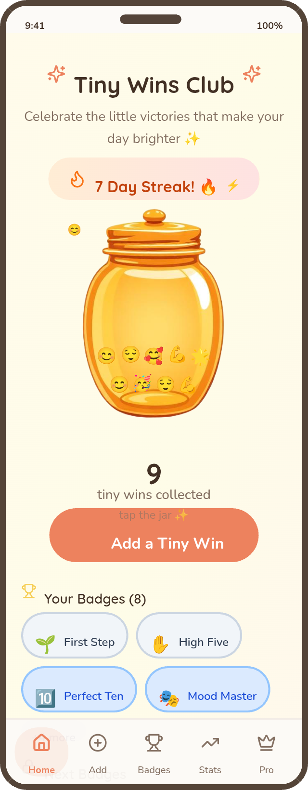
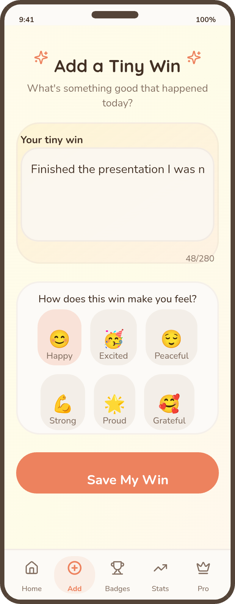
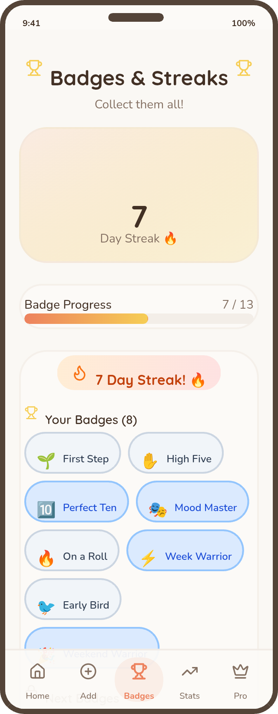
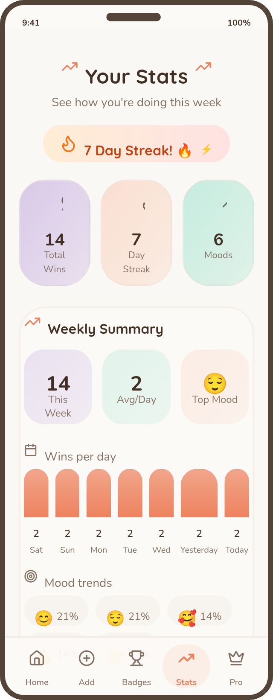
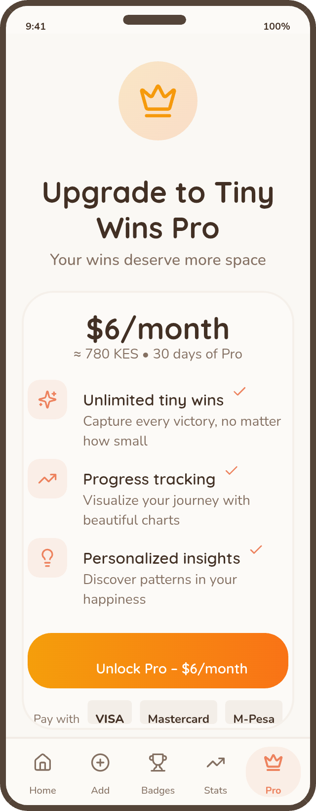

# TinyWins — Daily Wins Tracker

TinyWins is a lightweight habit and reflection app designed to help users notice and celebrate small daily wins.

I designed and built the product from concept to working application using AI-assisted development with Lovable, making the product, UX, workflow, and business decisions throughout the process.

**Live app:** https://tinywinsclub.lovable.app

## Product

TinyWins is built around a simple idea: small wins are worth noticing.

The product gives users a simple way to record daily wins, build a collection over time, and see their progress through badges and statistics.

The product includes:

- Daily wins
- Personal win jars
- Badges and milestones
- Progress statistics
- Free and Pro experiences
- Payment and subscription flows

## Product Design

### Daily Wins

The main experience gives users a simple place to capture the things they accomplished during the day.

### Add a Win

The add-win flow is designed to make recording a small achievement quick and simple.

### Badges

The badges experience gives users lightweight milestones as they continue recording their wins.

### Stats & Progress

The statistics view gives users a way to look back at their activity and see their progress over time.

### TinyWins Pro

The Pro experience expands the product with additional functionality beyond the free experience.

## My Role

I worked across the product from the initial concept through implementation and iteration.

### Product & UX

- Defined the product concept and overall user journey.
- Designed the daily win capture experience.
- Structured the free and Pro product experience.
- Designed the badges and progress experience.
- Thought through how the product could encourage continued use without making the experience complicated.
- Iterated on the interface and user flows during development.

### AI-Assisted Development

- Used Lovable as an AI-assisted development partner.
- Translated product requirements and UX decisions into working interfaces.
- Reviewed and iterated on generated implementation rather than treating the first output as final.
- Worked through responsive layouts, product states, and technical constraints during development.

### Integrations & Product Logic

- Worked with Supabase for application data and authentication.
- Implemented Free vs. Pro access logic.
- Worked with Paystack and M-Pesa payment flows.
- Worked with APIs and webhooks for payment-related functionality.
- Considered subscription states and access changes as part of the product experience.

## Design Approach

TinyWins was designed around reducing friction.

The core interaction is simple:

**Notice a win → record it → build momentum.**

Rather than adding a large number of productivity features, I focused on making the central action easy to understand and repeat.

The interface uses:

- Mobile-first layouts
- Simple navigation
- Clear calls to action
- Lightweight progress feedback
- Friendly visual language
- Short, focused interactions

One of the main design challenges was making the act of recording a win feel rewarding without turning it into another complicated productivity system.

## What I Learned

Building TinyWins taught me to think about product design beyond individual screens.

A simple feature such as recording a daily win creates product decisions around:

- How quickly someone can complete the action
- Empty and populated states
- Milestones and continued engagement
- Free vs. paid functionality
- Progress communication
- Subscription states
- Edge cases

Building the product myself meant thinking about both the user's experience and what was required to make that experience actually work.

## Built With

- Lovable — AI-assisted development
- React / TypeScript
- Tailwind CSS
- Supabase
- Paystack
- M-Pesa
- APIs & webhooks
- Progressive Web App (PWA)

## Project

- **Live:** https://tinywinsclub.lovable.app
- **Repository:** https://github.com/Winnie-png/tinywinsclub
